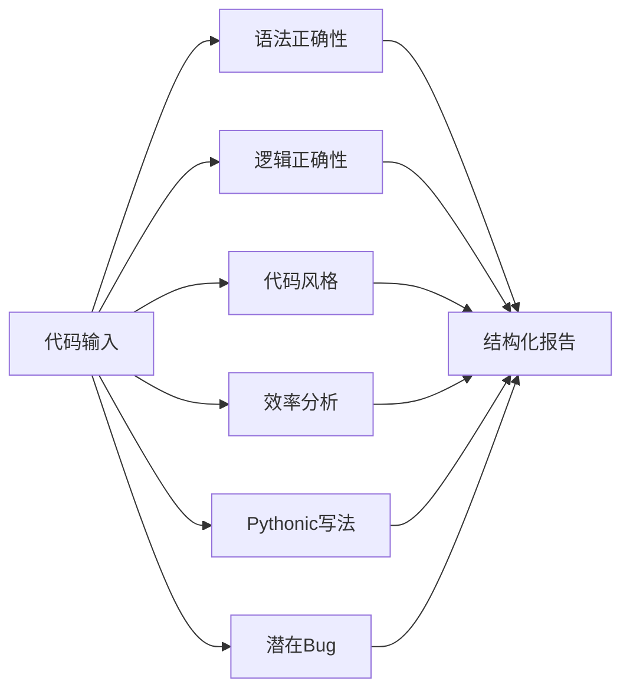

# 🐍 Python代码审查助教 Skill

> 面向大一下人工智能专业学生的结构化代码审查与优化助手

[](https://python.org)
[]()
[]()

## 📖 简介

这是一个为**大一下人工智能专业学生**设计的代码审查Skill。它让AI像"编程助教"一样，系统性地审查Python代码，指出问题、解释原因、给出改进方案，帮助学生建立代码质量意识。

**不是**工业级的安全审计工具，**而是**教学导向的学习助手。

## ✨ 功能特性

| 特性 | 说明 |
|:---|:---|
| 🔴 **三级严重度分级** | Critical / Warning / Suggestion，帮助学生区分优先级 |
| 📊 **复杂度分析** | 自动分析时间/空间复杂度，给出优化建议 |
| 🐍 **Pythonic培养** | 专门检查Python特性使用，培养Python思维 |
| 🛡️ **边界安全控制** | 拒绝非Python代码、限制长度、检测敏感操作 |
| 📝 **教学式输出** | 每个问题都解释"为什么错"和"怎么改" |

## 🚀 使用方法

### 方式一：作为System Prompt使用

1. 复制 [`SKILL.md`](./SKILL.md) 的全部内容
2. 粘贴到任意支持system prompt的AI平台（如DeepSeek、Claude、ChatGPT）
3. 粘贴你的Python代码，获取审查报告

### 方式二：在Cursor中使用

1. 将 [`.cursorrules`](./.cursorrules) 文件放入项目根目录
2. 在Cursor中打开Python文件，AI自动按规则审查

## 📁 项目结构

```
py-code-review-skill/
├── SKILL.md              # 核心Skill文件（完整规则）
├── .cursorrules          # Cursor IDE规则文件
├── test/
│   ├── test_cases.md     # 7个测试用例定义
│   └── test_results.md   # 测试结果记录
└── examples/             # 示例代码（供演示用）
    ├── example_01_max_negative.py
    ├── example_02_nested_loop.py
    ├── example_03_style_issues.py
    ├── example_04_mutable_default.py
    └── example_05_complete_correct.py
```

## 🧪 测试用例

本项目包含 **7个精心设计的测试用例**，覆盖不同场景：

| 编号 | 场景 | 预期发现问题 |
|:---|:---|:---|
| [T01](examples/example_01_max_negative.py) | 找最大值但初始化错误 | 🔴 Critical：负数列表返回错误 |
| [T02](examples/example_02_nested_loop.py) | 双重循环找重复元素 | 🟡 Warning：可改为哈希表O(n) |
| [T03](examples/example_03_style_issues.py) | 变量名a,b,c，无注释 | 🟢 Suggestion：命名+注释 |
| [T04](examples/example_04_mutable_default.py) | 可变默认参数陷阱 | 🟡 Warning：默认参数累积 |
| [T05](examples/example_05_complete_correct.py) | 完全正确的代码 | ✅ 无问题，给出优化建议 |
| T06 | 缺少代码输入 | ✅ 正确引导用户补充 |
| T07 | 非Python代码 | ✅ 明确拒绝并给出替代方案 |

详细测试记录见 [`test/test_results.md`](test/test_results.md)。

## 📋 审查维度



## 🎯 适用场景

- ✅ Python编程作业自查
- ✅ 代码互审前的自我检查
- ✅ 学习Pythonic写法
- ✅ 理解时间/空间复杂度

## ❌ 不适用场景

- ❌ 非Python代码（C++/Java/JavaScript等）
- ❌ 超过200行的大型模块（建议分段审查）
- ❌ 生产环境安全审计（请用专业工具）
- ❌ 涉及敏感操作的代码（会警告但不保证安全）

## 📝 示例输出

### 输入
```python
def find_max(lst):
    max = 0
    for i in range(len(lst)):
        if lst[i] > max:
            max = lst[i]
    return max
```

### 输出
```
📋 Python代码审查报告

🔴 严重问题 (Critical) — 1个
1. [第2行] 初始化 max = 0 存在逻辑错误
   → 原因：当列表全为负数时，返回0而非实际最大值
   → 修改建议：改为 max_val = lst[0]（需先检查空列表）
   → 优化后代码：if not lst: return None; max_val = lst[0]

🟡 警告 (Warning) — 1个
...

🟢 建议 (Suggestion) — 1个
...

📊 复杂度分析
- 时间复杂度：O(n) ✓
- 空间复杂度：O(1) ✓

✅ 修改后完整代码
[完整优化代码]
```

## 🔧 技术细节

- **Skill格式**: SKILL.md (YAML frontmatter + Markdown body)
- **大模型**: 兼容任意支持system prompt的LLM（推荐DeepSeek V4）
- **触发方式**: 关键词匹配 + 代码块自动识别
- **输出格式**: 结构化Markdown，确保一致性

## 📚 设计背景

本项目源于人工智能通识课实践项目。在调研了GitHub上多个高星标Skill后，发现现有代码审查工具要么面向工业级（过于复杂），要么过于简单（只查语法），**缺少面向学生作业级别的、教学导向的审查Skill**。因此设计了本项目。

调研详情见项目报告第二章。

## 👤 作者

- **姓名**: [你的名字]
- **专业**: 人工智能专业 大一下
- **课程**: 人工智能通识课 · 实践项目

## 📄 许可证

MIT License
